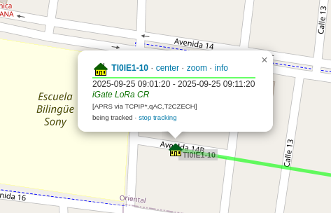

# 📡iGate LoRa/APRS - Proyecto

## 1. Introducción del Proyecto
Un iGate (gateway de Internet) en APRS LoRa es una estación base que recibe señales de otros dispositivos LoRa y las transmite a la red de Internet, haciendo la información disponible públicamente a través de la web.  

Los iGates no necesitan GPS porque están en una ubicación fija y son esenciales para expandir el alcance y la utilidad de la red APRS-LoRa. Recopilan datos de rastreo (trackers) y los envían a la plataforma de Internet para su visualización.

## 2. Conceptos Importantes

- **iGate:**  
  Puente entre la red LoRa e Internet, que recibe y retransmite los datos. Requiere un receptor de radio LoRa (generalmente en la frecuencia de 433 MHz) y un computador o mini-computador para conectarse a la web.

- **APRS (Automatic Packet Reporting System):**  
  Sistema de radioaficionados que transmite paquetes de datos con información como posición, mensajes y datos ambientales.

- **LoRa (Long Range):**  
  Tecnología de modulación que permite comunicación inalámbrica de largo alcance, mayor penetración de señal y bajo consumo energético.

- **Tracker:**  
  Dispositivo LoRa, usualmente con módulo GPS, que envía automáticamente su posición y otros datos.

- **Frecuencia:**  
  APRS-LoRa opera en frecuencias específicas; la banda de 433 MHz es común para estos sistemas.

- **Firmware:**  
  Software específico instalado en las placas de desarrollo para que los dispositivos funcionen como iGate o tracker.

- **Placa de desarrollo:**  
  Módulo electrónico con un módem LoRa, configurable como iGate o tracker mediante firmware.
    
### 2.1 Conexiones de Hardware

<p align="center">
  
</p>

**Figura 1:** Diagrama de referencia de los buses del LilyGO T3 LoRa32. Muestra las conexiones principales de la placa con los periféricos y fuentes de alimentación.

<p align="center">
  
</p>

**Figura 2:** Diagrama de conexiones simplificado realizado por el grupo. Detalla los elementos clave:

- **USB-Micro USB → PC:** Permite programar la placa y proveer alimentación mientras está conectada al computador.  
- **Antena LoRa → SX1276:** El módulo **SX1276** es el transceptor LoRa integrado en la placa. Se encarga de **transmitir y recibir paquetes de datos** en la frecuencia LoRa (433 MHz en nuestro caso). La antena se conecta a este módulo para mejorar la cobertura y la calidad de la señal.  
- **OLED → I2C:** La pantalla OLED de 0.96” se comunica mediante **I2C**, mostrando información del iGate, como el número de paquetes recibidos o estado de conexión.  
- **Batería → JST:** Conector para una batería Li-Po 3.7V que permite que el iGate funcione sin necesidad de estar conectado al USB.  

> 💡 Nota: Todas estas conexiones son internas en la placa LilyGO T3 LoRa32, excepto la antena y la batería, que se conectan externamente. La correcta conexión garantiza que el iGate pueda recibir paquetes LoRa, mostrarlos en el OLED y enviarlos a APRS-IS.

## 3. Diseño y Aplicación

Como aplicación para este sistema se pretende utilizar el LoRa iGate para el seguimiento en competiciones deportivas como por ejemplo carreras o ciclismo. Cada corredor, ciclista o atleta lleva un pequeño tracker LoRa APRS. En diferentes puntos estratégicos de la competencia se colocan iGates. Cada iGate recibe la señal LoRa y la reenvía automáticamente a la red APRS-IS a través de Internet. Los datos recopilados se pueden visualizar en plataformas como aprs.fi, o integrarse en un mapa personalizado del evento.

El iGate se configurará mediante programación directa en la placa LilyGO T3 LoRa32, siguiendo un flujo planificado que garantice la recepción y transmisión correcta de los datos. La implementación se realizará en varias etapas:

1. **Inicialización de Hardware y Firmware:**  
   - Configuración del microcontrolador ESP32 y del módulo LoRa SX1276.  
   - Inicialización de la pantalla OLED para mostrar información de estado.  
   - Verificación de la conexión a la fuente de alimentación (USB o batería Li-Po).

2. **Conexión a Internet:**  
   - Establecer conexión WiFi para poder enviar los paquetes recibidos hacia APRS-IS.  
   - Implementar control de errores para reconectar automáticamente en caso de caída de la red.

3. **Recepción de Paquetes LoRa:**  
   - Escuchar de forma continua la frecuencia de 433 MHz para recibir paquetes de trackers.  
   - Validar que los paquetes tengan el formato correcto de APRS-LoRa.

4. **Procesamiento y Registro de Datos:**  
   - Guardar los datos en un log local para seguimiento y depuración.  
   - Mostrar información resumida en la pantalla OLED (por ejemplo, número de paquetes recibidos, estado de conexión WiFi).

5. **Transmisión a APRS-IS:**  
   - Reenviar automáticamente los paquetes validados a la red APRS-IS.  
   - Implementar reintentos en caso de fallos de envío.

6. **Ciclo Continuo de Operación:**  
   - Repetir de manera indefinida los pasos anteriores, garantizando la disponibilidad del iGate como puente entre los trackers LoRa y la red de Internet.  

> 💡 Nota: Este enfoque asegura un **control total del sistema**, sin depender de aplicaciones externas de configuración. Cada etapa está planificada para facilitar depuración, escalabilidad y mantenimiento del iGate.

## 4. Lista de Hardware a utilizar

- T3 LoRa32 V1.6.1 – LILYGO®

## Requisitos adicionales

- **Fuente de alimentación**:  
  - USB-Micro USB desde la PC o cargador de 5 V  
  - (Opcional) Batería Li-Po de 3.7 V (ej. 1000–2000 mAh) para autonomía  

- **Antena LoRa**:  
  - Conector IPEX incluido  
  - **Importante:** siempre conectar la antena antes de transmitir para evitar dañar el módulo  

- **Cable USB-Micho USB**:  
  - Para programación y alimentación desde la computadora  

- **(Opcional) Regulador o power bank**:  
  - Alternativa de alimentación si no se usa batería Li-Po  

## Especificaciones de Hardware – LILYGO® T3 LoRa32 V1.6.1

<div align="center">
  <table>
    <tr>
      <th>Característica</th>
      <th>Especificación</th>
    </tr>
    <tr>
      <td>Microcontrolador</td>
      <td>ESP32 (Wi-Fi 802.11 b/g/n y Bluetooth 4.2 BR/EDR & BLE)</td>
    </tr>
    <tr>
      <td>Flash</td>
      <td>4 MB (SPI)</td>
    </tr>
    <tr>
      <td>SRAM</td>
      <td>520 KB</td>
    </tr>
    <tr>
      <td>Pantalla</td>
      <td>OLED 0.96” (128x64) integrada</td>
    </tr>
    <tr>
      <td>Módulo LoRa</td>
      <td>SX1276 LoRa transceiver</td>
    </tr>
    <tr>
      <td>Frecuencias</td>
      <td>433 MHz / 868 MHz / 915 MHz (según modelo)</td>
    </tr>
    <tr>
      <td>Interfaz</td>
      <td>USB Type-Micro USB (programación y alimentación)</td>
    </tr>
    <tr>
      <td>GPIOs</td>
      <td>Compatible con ESP32 estándar (UART, SPI, I2C, ADC, DAC, PWM)</td>
    </tr>
    <tr>
      <td>Alimentación</td>
      <td>5V vía USB-C o batería Li-Po 3.7V (conector JST)</td>
    </tr>
    <tr>
      <td>Carga de batería</td>
      <td>Circuito de carga integrado para Li-Po</td>
    </tr>
    <tr>
      <td>Antena</td>
      <td>Conector SMA/IPEX para antena externa LoRa</td>
    </tr>
    <tr>
      <td>Dimensiones</td>
      <td>25.6 x 51.2 mm aprox.</td>
    </tr>
  </table>
</div>


## 5. Diseño Planteado

### 5.1 Diagrama de Bloques
El diagrama de bloques de flujo representa de manera simplificada la arquitectura funcional del iGate LoRa/APRS. Permite visualizar cómo interactúan los distintos componentes del sistema para recibir, procesar y reenviar datos APRS:

<p align="center">
  
</p>

### 5.1 Pseudocódigo del iGate LoRa/APRS

A continuación se presenta el pseudocódigo del funcionamiento del iGate LoRa/APRS:

```text
Inicio del programa

// Configuración
Definir la red WiFi (nombre y contraseña)
Definir las credenciales de APRS-IS (indicativo y passcode)
Definir el servidor APRS-IS (dirección y puerto)

// Inicialización (Setup)
Iniciar la comunicación serial (para depuración)
Conectar a la red WiFi
Si la conexión WiFi falla, detener el programa

Configurar e iniciar el módulo LoRa
Si el módulo LoRa falla, detener el programa

Conectar al servidor APRS-IS
Si la conexión es exitosa, enviar la línea de login con el indicativo, passcode y versión
Si la conexión falla, mostrar un mensaje de error

// Bucle principal (Loop)
Bucle infinito:

  // Función de repetición (iGate)
  Revisar si hay un paquete de LoRa disponible:
    Si hay un paquete:
      Leer el mensaje completo del paquete LoRa
      Mostrar el mensaje recibido en el monitor serial
      Si la conexión a APRS-IS está activa:
        Construir un mensaje de APRS para reenvío (tu indicativo, >APRS, el mensaje recibido)
        Enviar el mensaje a APRS-IS
        Mostrar el mensaje enviado en el monitor serial

  // Función de baliza (Beacon)
  Comprobar si han pasado 30 segundos desde el último envío de beacon:
    Si han pasado 30 segundos Y la conexión a APRS-IS está activa:
      Construir el mensaje de beacon APRS (tu indicativo, ">APRS", ubicación fija y mensaje de prueba)
      Enviar el mensaje de beacon a APRS-IS
      Mostrar el mensaje de beacon enviado en el monitor serial
      Reiniciar el temporizador del beacon

Fin del programa
```

### 5.2 Máquina de Estados (firmware interno en LILYGO)
El diagrama de estados muestra la máquina de estados interna del firmware del iGate, describiendo cómo cambia el comportamiento del sistema según las condiciones de operación:

<p align="center">
  
</p>

## 6. Avance de Código de Programación

### 6.1 Preparación del entorno y programación

1. Instalar Arduino IDE

Para Linux (Ubuntu) seguir los siguientes pasos:
- **Descargar la última versión:**

```bash
mkdir -p ~/Documents/arduino
cd ~/Documents/arduino
wget https://downloads.arduino.cc/arduino-ide/arduino-ide_2.3.4_Linux_64bit.AppImage
```
2. **Dar permisos de ejecución**
```bash
chmod +x arduino-ide_2.3.4_Linux_64bit.AppImage
```
3. **Instalar dependencias necesarias (Recomendado)**
```bash
sudo apt update
ssudo apt install libfuse2 libcanberra-gtk-module libcanberra-gtk3-module
```
4. **Ejecutar el IDE**
```bash
./arduino-ide_2.3.4_Linux_64bit.AppImage
```
5. **Si hay problemas de SandBox, ejecutar:**
```bash
./arduino-ide_2.3.4_Linux_64bit.AppImage --no-sandbox
```
6. **Configuración del Arduino IDE para ESP32**
 - 6.1. Abrir Arduino IDE:
 - 6.2. Ir a Archivo → Preferencias.
 - 6.3. En Gestor de URLs adicionales de tarjetas, agregar (paquetes necesarios para el uso de ESP32):
 
```bash
https://raw.githubusercontent.com/espressif/arduino-esp32/gh-pages/package_esp32_index.json
```
- 6.4 **Clic en OK.**
- 6.5 **Instalar soporte ESP32:**
    - 6.5.1 Ir a Herramientas → Placa → Gestor de placas…
    - Buscar ESP32 y hacer clic en Instalar en la versión estable. (Espressif Systems)
    - 6.5.2 Instalar librerías necesarias: En Arduino IDE: Programa → Incluir Librería → Gestionar Librerías…
    - Buscar e instalar: LoRa (para el módulo SX1276(Sandeep Mistry)), WiFi (ya viene incluida con ESP32), TinyGPS++ (si se quiere simular GPS (Mikal Hart))
    
7. **Conectar la LilyGO**
- Conecta la placa vía USB - Micro USB.
- Ir a Herramientas → Puerto y seleccionar el puerto correspondiente.
- Ir a Herramientas → Placa → ESP32 Arduino → LilyGO T3 LoRa32 (o genérica ESP32 si no aparece).

## Programación

### 6.2 iGate LoRa APRS
Este código inicializa un iGate LoRa APRS en un ESP32. Se conecta a WiFi, recibe paquetes LoRa y los reenvía a la red APRS-IS. Además, envía un beacon de prueba cada 30 segundos. La comunicación LoRa se hace mediante el módulo SX1276 conectado por SPI, y APRS-IS mediante la librería APRSIS.

1. **Preparar los datos**:
- **Datos de Configuración importantes**:
```cpp
// WiFi
const char* ssid = "TU_WIFI";         // Aquí va el nombre de tu red WiFi
const char* password = "TU_PASSWORD"; // Aquí la contraseña de tu WiFi

// APRS-IS
const char* callsign = "TU_CALLSIGN";      // Tu indicativo (ej. TI0IE1-10)
const char* aprsPasscode = "TU_PASSCODE"; // Código que generaste en https://aprs.fi/passcode
const char* aprsServer = "euro.aprs2.net";// Servidor APRS-IS a conectar
const int aprsPort = 14580;                // Puerto del servidor APRS-IS
```
💡 Tip: Si no tienes passcode, ve a APRS Passcode Generator

2. **Conectar el hardware**:
- Conecta la LilyGO T3 LoRa32 al PC usando el USB-Micro.
- Asegúrate de tener antena LoRa conectada, aunque sea solo para pruebas de recepción.
- Si quieres, puedes usar la batería Li-Po para pruebas sin USB, pero no es obligatorio ahora.

3. **Seleccionar placa y puerto en Arduino IDE**

- Abre Arduino IDE.
- Ve a Herramientas → Placa → ESP32 Arduino → LilyGO T3 LoRa32 (o ESP32 genérico si no aparece).
- Ve a Herramientas → Puerto y selecciona el puerto USB donde está conectada la LilyGO.

4. **Subir el código**
- Haz clic en “Subir” (Upload) en Arduino IDE.
- Espera a que compile y cargue.
- Abre el Monitor Serial (Herramientas → Monitor Serial) a 115200 baudios para ver la salida en tiempo real.

5. **Verificar funcionamiento**
- En el Monitor Serial deberías ver algo como:

```
Iniciando iGate LoRa APRS...
Conectando a WiFi...
WiFi conectado!
LoRa inicializado en 433.775 MHz
Conectado a APRS-IS!
Paquete recibido: TI0IE1>APRS,TCPIP*:... 
Paquete reenviado a APRS-IS
Beacon enviado a APRS-IS
```
Cada paquete LoRa que reciba la placa se imprimirá y se enviará a APRS-IS.
Cada 30 segundos se envía un beacon de prueba automáticamente.

**Código (C++)**

```c++

#include <WiFi.h>
#include <SPI.h>
#include <LoRa.h>

// ---------- WiFi ----------
const char* WIFI_SSID = "Dracarys";
const char* WIFI_PASS = "Contraseña";

// ---------- APRS-IS ----------
const char* APRS_SERVER = "euro.aprs2.net";
const uint16_t APRS_PORT = 14580;

// Usa MAYÚSCULAS y SSID -10 para iGate
const char* CALLSIGN = "TI0IE1-10";
const char* PASSCODE = "21203";
// (Opcional) filtro APRS-IS; "" si no quieres
const char* APRS_FILTER = "m/50";

WiFiClient aprs;

// ---------- LoRa (LilyGO T3 LoRa32 / SX1276) ----------
#define LORA_SCK    5
#define LORA_MISO  19
#define LORA_MOSI  27
#define LORA_SS    18
#define LORA_RST   14
#define LORA_DIO0  26
const long LORA_FREQ = 433775000; // 433.775 MHz

// Parámetros típicos LoRa-APRS
#define LORA_SF    12
#define LORA_BW    125E3
#define LORA_CR    5
#define LORA_SYNC  0x12
// #define USE_CRC  // descomenta si tu red usa CRC

unsigned long lastBeacon = 0;
const unsigned long BEACON_MS = 30000;

// ---------- Utilidades ----------
void ensureWiFi() {
  if (WiFi.status() == WL_CONNECTED) return;
  Serial.printf("Conectando a WiFi %s", WIFI_SSID);
  WiFi.mode(WIFI_STA);
  WiFi.begin(WIFI_SSID, WIFI_PASS);
  uint32_t t0 = millis();
  while (WiFi.status() != WL_CONNECTED && millis() - t0 < 20000) {
    Serial.print(".");
    delay(500);
  }
  Serial.println(WiFi.status() == WL_CONNECTED ? " OK" : " FAIL");
}

bool ensureAPRS() {
  if (aprs.connected()) return true;
  Serial.printf("Conectando a APRS-IS %s:%u\n", APRS_SERVER, APRS_PORT);
  if (!aprs.connect(APRS_SERVER, APRS_PORT)) {
    Serial.println("Fallo de conexión APRS-IS");
    return false;
  }
  // Login APRS-IS
  String login = "user ";
  login += CALLSIGN;
  login += " pass ";
  login += PASSCODE;
  login += " vers ESP32_iGate 1.0";
  if (APRS_FILTER[0] != '\0') {
    login += " filter ";
    login += APRS_FILTER;
  }
  login += "\r\n";
  aprs.print(login);
  Serial.print("Login enviado: "); Serial.print(login);
  return true;
}

void sendAprsLine(const String& line) {
  if (!ensureAPRS()) return;
  if (line.endsWith("\r\n")) aprs.print(line);
  else aprs.print(line + "\r\n");
}

void sendBeacon() {
  // REEMPLAZA por tu lat/lon y símbolo APRS correctos
  // Formato ejemplo: !DDMM.mmN/DDDMM.mmW-Comentario
  String beacon = String(CALLSIGN) + ">APRS,TCPIP*:" +
                  "!coordenadas-iGate LoRa CR";
  sendAprsLine(beacon);
  Serial.println("Beacon enviado: " + beacon);
}

void setupLoRa() {
  SPI.begin(LORA_SCK, LORA_MISO, LORA_MOSI, LORA_SS);
  LoRa.setPins(LORA_SS, LORA_RST, LORA_DIO0);
  if (!LoRa.begin(LORA_FREQ)) {
    Serial.println("Error LoRa.begin()");
    while (true) delay(1000);
  }
  LoRa.setSpreadingFactor(LORA_SF);
  LoRa.setSignalBandwidth(LORA_BW);
  LoRa.setCodingRate4(LORA_CR);
  LoRa.setSyncWord(LORA_SYNC);
  #ifdef USE_CRC
  LoRa.enableCrc();
  #endif
  Serial.println("LoRa listo en 433.775 MHz");
}

// ========= AQUÍ ESTÁN setup() Y loop() =========
void setup() {
  Serial.begin(115200);
  delay(300);
  Serial.println("\n[LoRa → APRS-IS iGate] arrancando...");

  ensureWiFi();
  setupLoRa();
  ensureAPRS();

  if (aprs.connected()) sendBeacon();
  lastBeacon = millis();
}

void loop() {
  ensureWiFi();
  ensureAPRS();

  // LoRa → APRS-IS
  int packetSize = LoRa.parsePacket();
  if (packetSize) {
    String loraMsg;
    while (LoRa.available()) loraMsg += (char)LoRa.read();
    loraMsg.trim();
    Serial.println("LoRa recibido: " + loraMsg);

    if (aprs.connected()) {
      // Si ya viene como "CALL>APRS,..." reenvíalo tal cual.
      // Si no, lo empaquetamos simple como mensaje APRS
      String aprsMsg = String(CALLSIGN) + ">APRS,TCPIP*:" + loraMsg;
      sendAprsLine(aprsMsg);
      Serial.println("Enviado a APRS-IS: " + aprsMsg);
    }
  }

  // Beacon cada 30 s
  if (millis() - lastBeacon > BEACON_MS && aprs.connected()) {
    sendBeacon();
    lastBeacon = millis();
  }

  // (Opcional) lee respuesta del servidor
  while (aprs.connected() && aprs.available()) Serial.write(aprs.read());
}

```
### 6.3 Pruebas Preliminares

Durante las primeras pruebas con el iGate LoRa/APRS, se realizaron las siguientes observaciones:

1. **Compilación y carga del código**  
   El código inicial se compiló y cargó al LilyGO sin errores en el IDE.  

<p align="center">
  
</p>

**Figura 1:** Monitor serial mostrando que el código se cargó correctamente y no se presentan errores (*Idle*).

2. **Modo Listening del LilyGO**  
   Al encenderse, el dispositivo mostraba en la pantalla el mensaje **Listening**, indicando que estaba listo para recibir paquetes LoRa.  

<p align="center">
  
</p>

**Figura 2:** Pantalla del LilyGO mostrando *Listening*, indicando que el iGate está activo y a la espera de paquetes.

3. **Visualización en APRS.fi**  
   Buscando el callsign del iGate en [aprs.fi](https://aprs.fi), el dispositivo aparecía en la ubicación programada, confirmando la conexión correcta con la red APRS-IS.  

<p align="center">
  
</p>

**Figura 3:** Mapa de APRS.fi mostrando la ubicación del iGate.

4. **Recepción de Raw Packets**  
   Se observaron **raw packets** en la página de APRS.fi.  

<p align="center">
  
</p>

**Figura 4:** Sección de *raw packets* en APRS.fi. Los raw packets son los mensajes APRS recibidos tal como llegaron, sin procesamiento. Esto confirma que el iGate está recibiendo y retransmitiendo correctamente los paquetes LoRa a APRS-IS.

5. **Prueba de Beacons**  
   Al enviar beacons personalizados, el iGate transmitió correctamente las coordenadas fijas configuradas en el código, ignorando la posición obtenida por el GPS integrado. De esta forma, el beacon se publicó en APRS-IS mostrando las coordenadas predefinidas, las cuales corresponden a una ubicación de prueba en Panamá.  
   
<p align="center">
  
</p>

**Resumen:**  
Las pruebas preliminares confirman que el iGate recibe y retransmite paquetes LoRa a APRS-IS, visualizables en el mapa y en *raw packets*. Además, el envío de beacons personalizados funcionó como se esperaba, evidenciando la ubicación de prueba en Panamá según los datos programados en el firmware. Este resultado valida el correcto control de las tramas de beacon y permitirá continuar con la integración de nuevas funciones en futuras etapas.


## 6. Cronograma Preliminar

| Semana | Actividad / Objetivo | Avance Estimado |
|--------|--------------------|----------------|
| 5      | Configuración de entorno de programación y pruebas iniciales con la LilyGO T3. | ✅ Completado |
| 6      | Desarrollo inicial del código: <br> - Recepción de paquetes LoRa <br> - Conexión a WiFi <br> - Estructura básica para envío a APRS-IS | ✅ Completado |
| 7      | Integración hardware-software y pruebas de funcionamiento: <br> - Conectar antena LoRa <br> - Verificar envío de datos a APRS-IS <br> - Depurar errores iniciales | ✅ Completado |
| 8      | **Entrega parcial (Informe y Presentación Parcial)**: <br> - Diagramas de bloques y máquina de estados <br> - Listado de hardware y justificación técnica <br> - Planteamiento estructurado del diseño <br> - Implementación en hardware y bus de conexión <br> - Tipo de comunicación de cada periférico <br> - Pseudo-código para control del sistema <br> - Definición de tramas de datos <br> - Cronograma y presupuesto para las semanas restantes <br> - Código inicial en GitHub documentado | ✅ Completado |
| 9-15   | Implementación y Evaluación Continua: <br> - Pruebas de recepción y transmisión de trackers <br> - Depuración y refinamiento del código <br> - Commits regulares y documentados en GitHub <br> - Visualización de datos en APRS.fi y aprsdirect.de | ⚙️ En progreso |
| 16     | Defensa del Proyecto Final: <br> - Entrega de informe completo <br> - Presentación final <br> - Código final documentado y funcional <br> - Confirmación de publicación de datos en APRS | ⏳ Planeado |


