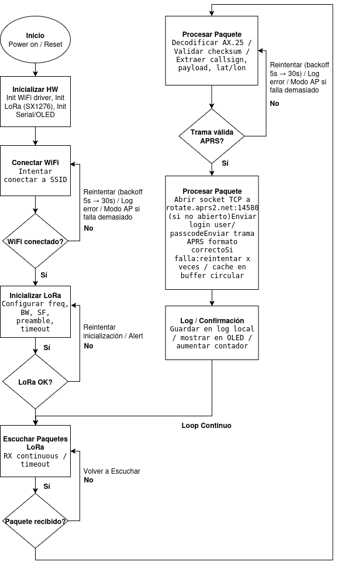

# iGate LoRa/APRS - Proyecto

## 1. Introducción del Proyecto

Un iGate (gateway de Internet) en APRS LoRa es una estación base que recibe señales de otros dispositivos LoRa y las transmite a la red de Internet, haciendo la información disponible públicamente a través de la web.  

Los iGates no necesitan GPS porque están en una ubicación fija y son esenciales para expandir el alcance y la utilidad de la red APRS-LoRa. Recopilan datos de rastreo (trackers) y los envían a la plataforma de Internet para su visualización.

---

## 2. Conceptos Importantes

- **iGate:**  
  Puente entre la red LoRa e Internet, que recibe y retransmite los datos. Requiere un receptor de radio LoRa (generalmente en la frecuencia de 433 MHz) y un computador o mini-computador para conectarse a la web.

- **APRS (Automatic Packet Reporting System):**  
  Sistema de radioaficionados que transmite paquetes de datos con información como posición, mensajes y datos ambientales.

- **LoRa (Long Range):**  
  Tecnología de modulación que permite comunicación inalámbrica de largo alcance, mayor penetración de señal y bajo consumo energético.

- **Tracker:**  
  Dispositivo LoRa, usualmente con módulo GPS, que envía automáticamente su posición y otros datos.

- **Frecuencia:**  
  APRS-LoRa opera en frecuencias específicas; la banda de 433 MHz es común para estos sistemas.

- **Firmware:**  
  Software específico instalado en las placas de desarrollo para que los dispositivos funcionen como iGate o tracker.

- **Placa de desarrollo:**  
  Módulo electrónico con un módem LoRa, configurable como iGate o tracker mediante firmware.
  
### 2.1 Conexiones de Hardware

<p align="center">
  
</p>
<p align="center">
  Figura 1: Diagrama de buses del LilyGO T3 LoRa32 (tomado de referencia)
</p>

<p align="center">
  
</p>
<p align="center">
  Figura 2: Diagrama de conexiones simple
</p>

## 3. Diseño y Planificación

Como aplicación para este sistema se pretende utilizar el LoRa iGate para el seguimiento en competiciones deportivas como por ejemplo carreras o ciclismo. Cada corredor, ciclista o atleta lleva un pequeño tracker LoRa APRS. En diferentes puntos estratégicos de la competencia se colocan iGates. Cada iGate recibe la señal LoRa y la reenvía automáticamente a la red APRS-IS a través de Internet. Los datos recopilados se pueden visualizar en plataformas como aprs.fi, o integrarse en un mapa personalizado del evento.

### Diagrama de Bloques Inicial
### Máquina de Estados Inicial

## 4. Lista de Hardware a utilizar

- T3 LoRa32 V1.6.1 – LILYGO®

## Requisitos adicionales

- **Fuente de alimentación**:  
  - USB-C desde la PC o cargador de 5 V  
  - (Opcional) Batería Li-Po de 3.7 V (ej. 1000–2000 mAh) para autonomía  

- **Antena LoRa**:  
  - Conector IPEX incluido  
  - **Importante:** siempre conectar la antena antes de transmitir para evitar dañar el módulo  

- **Cable USB-C**:  
  - Para programación y alimentación desde la computadora  

- **(Opcional) Regulador o power bank**:  
  - Alternativa de alimentación si no se usa batería Li-Po  

## Especificaciones de Hardware – LILYGO® T3 LoRa32 V1.6.1

| Característica       | Especificación |
|-----------------------|----------------|
| **Microcontrolador** | ESP32 (Wi-Fi 802.11 b/g/n y Bluetooth 4.2 BR/EDR & BLE) |
| **Flash**            | 4 MB (SPI) |
| **SRAM**             | 520 KB |
| **Pantalla**         | OLED 0.96” (128x64) integrada |
| **Módulo LoRa**      | SX1276 LoRa transceiver |
| **Frecuencias**      | 433 MHz (en este caso) / 868 MHz / 915 MHz (según modelo) |
| **Interfaz**         | USB Type-C (programación y alimentación) |
| **GPIOs**            | Compatible con ESP32 estándar (UART, SPI, I2C, ADC, DAC, PWM) |
| **Alimentación**     | 5V vía USB-C o batería Li-Po 3.7V (conector JST) |
| **Carga de batería** | Circuito de carga integrado para Li-Po |
| **Antena**           | Conector SMA/IPEX para antena externa LoRa |
| **Dimensiones**      | 25.6 x 51.2 mm aprox. |


## 5. Diseño Planteado

Paso 1. Descargar e instalar ¨Visual Studio Code¨

Paso 2. Descargar desde Github los parquetes de iGate.

Paso 3. Configurar el iGate en VS Code y cargar su placa vía USB:

-Identificar el tipo de tarjeta---"LILYGO"---Import(paquetes)---Upload
-Conf.data
-Conectar la tarjeta al PC vía USB
-Build (compilar) --- Upload --- Upload Filesystem Image

### 5.1 Diagrama de Bloques
<p align="center">
  
</p>

### 5.2 Máquina de Estados-Máquina de Estados (firmware interno en LILYGO)

<p align="center">
  
</p>

## 6. Avance de Código de Programación

## Programación

Para programar la tarjeta como un **iGate LoRa APRS**, es necesario:

### Requisitos de software
- **Arduino IDE** (o PlatformIO en VSCode).  
- **Librerías necesarias**:
  - [RadioHead](http://www.airspayce.com/mikem/arduino/RadioHead/) → Manejo del módulo LoRa.  
  - [APRS-IS Client](https://github.com) → Comunicación con servidores APRS-IS.  
  - [TinyGPS++](https://github.com/mikalhart/TinyGPSPlus) → Lectura del GPS.  
  - WiFi (incluida en ESP32) → Conexión a Internet para subir datos a APRS-IS.  

### Ejemplo básico de iGate
El siguiente código es un **ejemplo mínimo** de cómo se estructura un iGate LoRa APRS en ESP32:

```cpp
#include <RadioHead.h>
#include <WiFi.h>
#include <TinyGPS++.h>

// Credenciales WiFi
const char* ssid = "TU_WIFI";
const char* password = "TU_PASSWORD";

// Configuración LoRa
#define LORA_SS 18
#define LORA_RST 14
#define LORA_DIO0 26

void setup() {
  Serial.begin(115200);
  WiFi.begin(ssid, password);

  // Esperar conexión WiFi
  while (WiFi.status() != WL_CONNECTED) {
    delay(500);
    Serial.print(".");
  }
  Serial.println("WiFi conectado!");

  // Inicializar LoRa (ejemplo simplificado)
  if (!LoRa.begin(868E6)) {   // Cambiar a 915E6 según tu región
    Serial.println("Error al iniciar LoRa");
    while (1);
  }
  Serial.println("LoRa inicializado");
}

void loop() {
  // Aquí se reciben paquetes LoRa y se reenvían a APRS-IS
}
```

## 6. Cronograma Preliminar

| Semana | Actividad / Objetivo | Avance Estimado |
|--------|--------------------|----------------|
| 5      | Configuración de entorno de programación y pruebas iniciales con la LilyGO T3. | ⚙️ En progreso |
| 6      | Desarrollo inicial del código: <br> - Recepción de paquetes LoRa <br> - Conexión a WiFi <br> - Estructura básica para envío a APRS-IS | ⚙️ En progreso |
| 7      | Integración hardware-software y pruebas de funcionamiento: <br> - Conectar antena LoRa <br> - Verificar envío de datos a APRS-IS <br> - Depurar errores iniciales | ⚙️ En progreso |
| 8      | **Entrega parcial (Informe y Presentación Parcial)**: <br> - Diagramas de bloques y máquina de estados <br> - Listado de hardware y justificación técnica <br> - Planteamiento estructurado del diseño <br> - Implementación en hardware y bus de conexión <br> - Tipo de comunicación de cada periférico <br> - Pseudo-código para control del sistema <br> - Definición de tramas de datos <br> - Cronograma y presupuesto para las semanas restantes <br> - Código inicial en GitHub documentado | ⚙️ En progreso |


